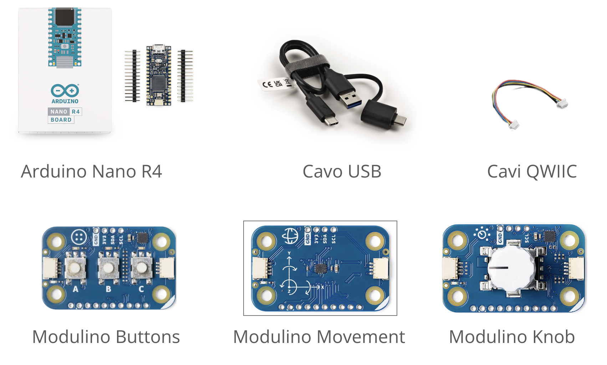
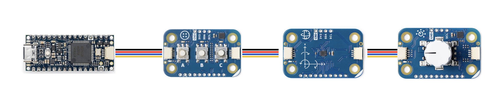
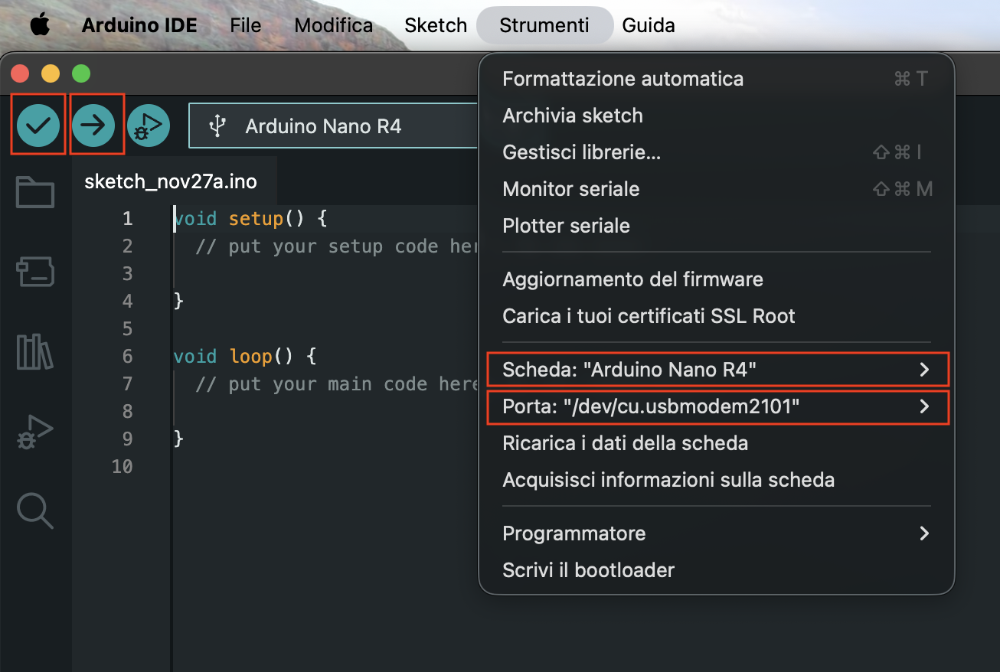

# Joystick USB con Arduino e Modulino

Questa guida spiega come creare un semplice joystick USB per PC compatibile con il gioco sparatutto online [krunker.io](https://krunker.io/) utilizzando Arduino.
Il controller può essere adattato anche per altri giochi: modificando lo sketch è possibile emulare tasti di tastiera e movimenti del mouse a piacimento, personalizzando completamente il comportamento del joystick.

# 🛠️ Requisiti
- PC con installato Arduino IDE
- Cavo USB C
- Arduino Nano R4
- Arduino Modulino: Knob, Movement, Buttons
- Joystick pad 3D stampato

# 📌 Istruzioni

### **1. Collegare i Modulino in cascata**

_Collega Knob, Movement e Buttons come in figura (l’ordine dei Modulino non è importante)._

### **2. Posizionare e avvitare i modulino e la scheda sul joystick 3D a piacimento**

### **3. Collegare la scheda Arduino al pc con il cavo USB**

### **4. Aprire Arduino IDE**

_Avvia l’ambiente di sviluppo ufficiale di Arduino._

### **5. Creare un nuovo sketch**

_Vai su: File → Nuovo_

### **6. Copiare il contenuto di [krunker_pad.ino](/krunker_pad/krunker_pad.ino)**

_Incolla tutto il codice dello sketch fornito all’interno del nuovo file._

### **7. Compilare e caricare lo sketch sulla scheda**

- Seleziona la scheda corretta su Strumenti → Scheda → Arduino Nano R4
- Seleziona la porta USB corretta su Strumenti → Porta
- Premi il pulsante ✔ Compila per verificare che il codice sia corretto
- Premi ➡ Carica per trasferire lo sketch sulla scheda

_Quando il caricamento è completato, la scheda si riavvierà automaticamente._

### **8. Comprendere e modificare lo sketch**

_Il codice è pensato per essere facilmente adattabile:
puoi modificare sensibilità, mappatura dei tasti, logiche di input e altro ancora._

### **9. Testare il joystick nel gioco o in un editor di testo**

_Dopo aver caricato lo sketch, l’Arduino verrà riconosciuto come dispositivo USB (tastiera e mouse).
Provalo su [krunker.io](https://krunker.io/), che è uno sparatutto in prima persona, oppure se preferisci guidare testalo su [slowroads.io](https://slowroads.io/) o su qualsiasi altro gioco online che utilizza mouse e tastiera._

### **10. Divertirsi! 🎮**

_Personalizza, sperimenta e goditi il tuo controller DIY._
